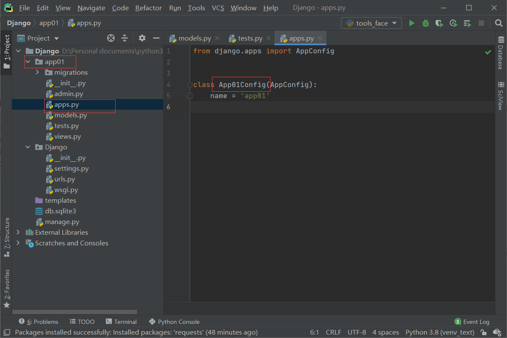

### Django安装

```python
命令行操作：
	1.创建Django项目
    	django-admin startproject mysite(项目名)
	2.启动Django项目
    	cd mysite
    	python3 manage.py runserver
	3.创建应用
    	python manage.py startapp app01
        
pycharm安装：
	1.new project
    	选择左侧第二个django即可
	2.启动
    3.创建应用，同上

    
注意:
# 如何让你的计算机能够正常的启动django项目
	1.计算机的名称不能有中文
	2.一个pycharm窗口只开一个项目
	3.项目里面所有的文件也尽量不要出现中文
	4.python解释器尽量使用3.4~3.6之间的版本
  		(如果你的项目报错 你点击最后一个报错信息去源码中把逗号删掉)
    
# django版本问题
	1.X 2.X 3.X(直接忽略)
  		1.X和2.X本身差距也不大 我们讲解主要以1.X为例 会讲解2.X区别
  		公司之前用的1.8 刚刚过渡到了1.11版本 有一些项目用的2.0
 
# django安装
	pip3 install django==1.11.22
        如果已经安装了其他版本 无需自己卸载,直接重新装 会自动卸载安装新的
        如果报错 看看是不是timeout 如果是 那么只是网速波动重新安装即可
        验证是否安装成功的方式: 终端输入django-admin看看有没有反应
	若Python解释器用的是3.7+，建议安装Python1.17+版本，否则会启动失败
```


### Django目录结构

```python
主要文件介绍：
    -mysite项目总文件夹
        --mysite文件夹
        ---settings.py	    配置文件
        ---urls.py			路由与视图函数对应关系(路由层)
        ---wsgi.py			wsgiref模块(不考虑)
      --manage.py			django的入口文件
      --db.sqlite3			django自带的sqlite3数据库(小型数据库 功能不是很多还有bug)
      --app01文件夹
        ---admin.py			django后台管理
        ---apps.py			注册使用
        ---migrations文件夹  数据库迁移记录
        ---models.py		数据库相关的 模型类(orm)
        ---tests.py			测试文件
        ---views.py			视图函数(视图层)

```


### Django应用

```python
django是一款专门用来开发app的web框架
django框架就类似于是一所大学，app就是大学里面各个学院，一个app就是一个独立的功能模块
创建的应用一定要去配置文件中注册，不注册django框架不识别
INSTALLED_APPS = [
    'django.contrib.admin',
    'django.contrib.auth',
    'django.contrib.contenttypes',
    'django.contrib.sessions',
    'django.contrib.messages',
    'django.contrib.staticfiles',
    'app01.apps.App01Config',  # 全写
  	'app01',			 # 简写
]
注：用pycharm创建项目的时候 pycharm可以帮你创建一个app并且自动注册
```

Django创建app时，全写的具体格式




### Django三板斧

```python
views.py
	from django.shortcuts import HttpResponse,render,redirect

HttpResponse
	返回字符串类型的数据
		return HttpResponse('字符串')
render
	返回html文件的
		return render(request,'login.html')
redirect
	重定向
		return redirect('https://www.mzitu.com/')
		return redirect('/home/')

urls.py
	
    from app01 import views
    urlpatterns = [
        url(r'^admin/', admin.site.urls),
        url(r'^index/', views.index)
    ]
    
views.py
    def ab_render(request):
        # 视图函数必须要接受一个形参request
        user_dict = {'username':'jason','age':18}
        # 第一种传值方式:更加的精确 节省资源
        # return render(request,'01 ab_render.html',{'data':user_dict,'date':123})
        # 第二种传值方式:当你要传的数据特别多的时候
        """locals会将所在的名称空间中所有的名字全部传递给html页面"""
        return render(request,'01 ab_render.html',locals())
    
取消自动加斜杠，在settings.py中加上以下字段
	APPEND_SLASH = False
    
每个视图函数都必定返回一个HttpResponse
```


### 静态文件配置

```python
一般情况下，我们将HTML文件默认都放在templates文件夹下
将网站所使用的静态文件默认都放在static文件夹下
什么是静态文件：
	前端已经写好了的，能够直接调用使用的文件
    	例如网站写好的js，css文件，图片，第三方前端框架等等
Django默认是不会自动帮你创建static文件夹的，需要自己手动创建
一般情况下我们在static文件夹内还会做进一步的划分处理
	-static
  	--js
    --css
    --img
    其他第三方文件

在浏览器中输入url能够看到对应的资源，是因为后端提前开设了该资源的接口，若访问不到资源，说明后端没有开设该资源的访问接口
	http://127.0.0.1:8000/static/bootstrap-3.3.7-dist/css/bootstrap.min.css
            
当你在写django项目的时候 可能会出现后端代码修改了但是前端页面没有变化的情况
    1.你在同一个端口开了好几个django项目 
        一直在跑的其实是第一个django项目

    2.浏览器缓存的问题
        settings
            network
                disable cache 勾选上


静态文件配置：
	STATIC_URL = '/static/'  # HTML中使用的静态文件夹前缀
    STATICFILES_DIRS = [
        os.path.join(BASE_DIR, "static"),  # 静态文件存放位置，可以放多个，第一个找不到去第二个里面找，直到找完或者找打，优先级从上往下依次查找，查找到一个就不会继续往下找了
    ]

静态文件动态解析：
	       #类似于导模块，加载静态资源
    <link rel="stylesheet" href="">   #动态加载来自STATIC_URL下的路径
    <script src=""></script>


在前期我们使用Django提交post请求的时候，需要在配置文件中取消csrf中间件
这个插件是Django提供的认证插件，后面会详细的讲
    MIDDLEWARE = [
        'django.middleware.security.SecurityMiddleware',
        'django.contrib.sessions.middleware.SessionMiddleware',
        'django.middleware.common.CommonMiddleware',
        # 'django.middleware.csrf.CsrfViewMiddleware',
        'django.contrib.auth.middleware.AuthenticationMiddleware',
        'django.contrib.messages.middleware.MessageMiddleware',
        'django.middleware.clickjacking.XFrameOptionsMiddleware',
    ]
    
补充：
	form表单默认是get请求数据
		http://127.0.0.1:8000/login/?username=jason&password=123

    form表单action参数
        1.不写 默认朝当前所在的url提交数据
        2.全写 指名道姓
        3.只写后缀 /login/

```


### request对象方法初识

```python
request.method # 返回请求方式 并且是全大写的字符串形式  <class 'str'>
request.POST  # 获取用户post请求提交的普通数据不包含文件
	request.POST.get()  # 只获取列表最后一个元素
  	request.POST.getlist()  # 直接将列表取出
request.GET  # 获取用户提交的get请求数据
	request.GET.get()  # 只获取列表最后一个元素
  	request.GET.getlist()  # 直接将列表取出
    
案例：登录页面
	def login(request):
    if request.method == 'GET':
        print('GET')
        return render(request, 'login.html')
    
    if request.method == 'POST':
        return HttpResponse("POST")
    return render(request, 'login.html')


两种提交方式的区别：
	get：
    	请求携带的数据是在URL中
        请求的数据有大小限制2048
        效率比post好
        可以回退，数据不会丢失
        只允许 ASCII 字符。
    post：
		所有的数据都是放在头部中
        没有数据限制
        不可回退，回退之后数据需要重新提交
        没有限制。也允许二进制数据。
        
```

