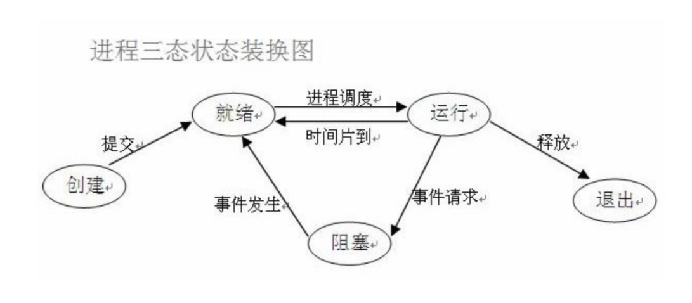
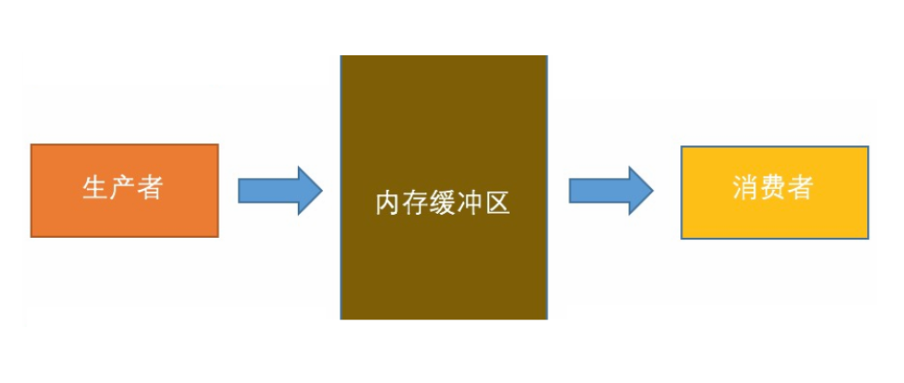

### 知识回顾

```Python
什么是计算机：
	计算机又叫电脑，即通电的大脑，发明计算机是为了让他通电之后能够像人一样去工作，并且它比人的工作效率更高，因为可以24小时不间断

计算机五大组成部分：
	控制器，运算器，存储器，输入设备，输出设备

计算机的核心真正干活的是CPU(控制器+运算器=中央处理器)

程序要想被计算机运行，它的代码必须要先由硬盘读到内存，之后cpu取指再执行
```


### 多道技术

```python
空间上的服用与时间上的复用
	空间上的复用
		多个程序公用一套计算机硬件

	时间上的复用
        例子:洗衣服30s，做饭50s，烧水30s
        单道需要110s，多道只需要任务做长的那一个 		切换节省时间
        例子:边吃饭边玩游戏							   保存状态
```


### CPU的进程调度

```python
先来先服务fcfs(first come first server):
    先来的先执行，对长作业有利，对短作业无益

短作业优先算法:
    分配的cpu多,先把短的算完，对短作业有利，多长作业无益
    
时间片轮转算法:
    每一个任务就执行一个时间片的时间.然后就执行其他的.
    
多级反馈队列算法：


越是时间长的,cpu分配的资源越少,优先级靠后
越是时间短的,cpu分配的资源越多

切换(CPU)分为两种情况
	1.当一个程序遇到IO操作的时候，操作系统会剥夺该程序的CPU执行权限
		作用:提高了CPU的利用率 并且也不影响程序的执行效率
	
	2.当一个程序长时间占用CPU的时候，操作吸引也会剥夺该程序的CPU执行权限
		弊端:降低了程序的执行效率(原本时间+切换时间)
```


### 并发与并行

```pytohn
并发：
	看起来像同时运行的就可以称之为并发
	比如一个cpu同一时间不停执行多个程序
	
并行：
	真正意义上的同时执行
	比如多个cpu同一时间不停执行多个程序
	
注：
	并行肯定算并发
	单核的计算机肯定不能实现并行，但是可以实现并发！！！
	我们直接假设单核就是一个核，干活的就一个人，不要考虑cpu里面的内核数
	
并行与并发的区别：
    并行是从微观上，也就是在一个精确的时间片刻，有不同的程序在执行，这就要求必须有多个处理器。
    并发是从宏观上，在一个时间段上可以看出是同时执行的，比如一个服务器同时处理多个session。
```


### 什么是进程

```python
进程就是正在运行的程序,它是操作系统中,资源分配的最小单位.
资源分配:分配的是cpu和内存等物理资源
进程号是进程的唯一标识

同一个程序执行两次之后是两个进程
进程和进程之间的关系: 数据彼此隔离,通过socket通信
```


### 进程的特征

```python
    动态性：进程的实质是程序在多道程序系统中的一次执行过程，进程是动态产生，动态消亡的。
    并发性：任何进程都可以同其他进程一起并发执行
    独立性：进程是一个能独立运行的基本单位，同时也是系统分配资源和调度的独立单位；
    异步性：由于进程间的相互制约，使进程具有执行的间断性，即进程按各自独立的、不可预知的速度向前推进
    结构特征：进程由程序、数据和进程控制块三部分组成。
    多个不同的进程可以包含相同的程序：一个程序在不同的数据集里就构成不同的进程，能得到不同的结果；但是执行过程中，程序不能发生改变。
```


### 进程的三状态图



```python
（1）就绪(Ready)状态
	当进程已分配到除CPU以外的所有必要的资源，只要获得处理机便可立即执行，这时的进程状态称为就绪状态。
（2）执行/运行（Running）状态
	当进程已获得处理机，其程序正在处理机上执行，此时的进程状态称为执行状态。
（3）阻塞(Blocked)状态
	正在执行的进程，由于等待某个事件发生而无法执行时，便放弃处理机而处于阻塞状态。引起进程阻塞的事件可有多种，例如，等待I/O完成、申请缓冲区不能满足、等待信件(信号)等。
```


### 同步和异步

```python
"""描述的是任务的提交方式"""
同步:任务提交之后，原地等待任务的返回结果，等待的过程中不做任何事(干等)
  	程序层面上表现出来的感觉就是卡住了

异步:任务提交之后，不原地等待任务的返回结果，直接去做其他事情
  	我提交的任务结果如何获取？
    任务的返回结果会有一个异步回调机制自动处理
```


### 阻塞非阻塞

```python
"""描述的程序的运行状态"""
阻塞:阻塞态
非阻塞:就绪态、运行态

理想状态:我们应该让我们的写的代码永远处于就绪态和运行态之间切换
```

```python
同步阻塞：效率低,cpu利用不充分
异步阻塞：比如socketserver,可以同时连接多个,但是彼此都有recv
同步非阻塞：没有类似input的代码,从上到下执行.默认的正常情况代码
异步非阻塞：效率是最高的,cpu过度充分,过度发热 液冷

上述概念的组合:最高效的一种组合就是异步非阻塞
```


### multiprocessing模块简介

```python
    python中的多线程无法利用多核优势，如果想要充分地使用多核CPU的资源（os.cpu_count()查看），在python中大部分情况需要使用多进程。Python提供了multiprocessing。 multiprocessing模块用来开启子进程，并在子进程中执行我们定制的任务（比如函数），该模块与多线程模块threading的编程接口类似。

    multiprocessing模块的功能众多：支持子进程、通信和共享数据、执行不同形式的同步，提供了Process、Queue、Pipe、Lock等组件。

    需要再次强调的一点是：与线程不同，进程没有任何共享状态，进程修改的数据，改动仅限于该进程内。
```


### Process类的介绍

```python
创建进程的类：
    Process([group [, target [, name [, args [, kwargs]]]]])，由该类实例化得到的对象，表示一个子进程中的任务（尚未启动）

强调：
    1. 需要使用关键字的方式来指定参数
    2. args指定的为传给target函数的位置参数，是一个元组形式，必须有逗号

参数介绍：
    group参数未使用，值始终为None
    target表示调用对象，即子进程要执行的任务
    args表示调用对象的位置参数元组，args=(1,2,'egon',)
    kwargs表示调用对象的字典,kwargs={'name':'egon','age':18}
    name为子进程的名称
    
方法介绍：
    p.start()：启动进程，并调用该子进程中的p.run() 
    p.run():进程启动时运行的方法，正是它去调用target指定的函数，我们自定义类的类中一定要实现该方法  
    p.terminate():强制终止进程p，不会进行任何清理操作，如果p创建了子进程，该子进程就成了僵尸进程，使用该方法需要特别小心这种情况。如果p还保存了一个锁那么也将不会被释放，进而导致死锁
    p.is_alive():如果p仍然运行，返回True
    p.join([timeout]):主线程等待p终止（强调：是主线程处于等的状态，而p是处于运行的状态）。timeout是可选的超时时间，需要强调的是，p.join只能join住start开启的进程，而不能join住run开启的进程
        
属性介绍：
    p.daemon：默认值为False，如果设为True，代表p为后台运行的守护进程，当p的父进程终止时，p也随之终止，并且设定为True后，p不能创建自己的新进程，必须在p.start()之前设置
    p.name:进程的名称
    p.pid：进程的pid
    p.exitcode:进程在运行时为None、如果为–N，表示被信号N结束(了解即可)
    p.authkey:进程的身份验证键,默认是由os.urandom()随机生成的32字符的字符串。这个键的用途是为涉及网络连接的底层进程间通信提供安全性，这类连接只有在具有相同的身份验证键时才能成功（了解即可）
```


### Process类的使用

​		**在windows中Process()必须放到# if __name__ == '__main__':下**

```python
    Since Windows has no fork, the multiprocessing module starts a new Python process and imports the calling module. 
    If Process() gets called upon import, then this sets off an infinite succession of new processes (or until your machine runs out of resources). 
    This is the reason for hiding calls to Process() inside

    if __name__ == "__main__"
    since statements inside this if-statement will not get called upon import.
    由于Windows没有fork，多处理模块启动一个新的Python进程并导入调用模块。 
    如果在导入时调用Process（），那么这将启动无限继承的新进程（或直到机器耗尽资源）。 
    这是隐藏对Process（）内部调用的原，使用if __name__ == “__main __”，这个if语句中的语句将不会在导入时被调用。
```


### 开启进程的两种方式

​	**注：代码开启进程和线程的方式，代码书写基本是一样的，学会了如何开启进程就学会了如何开启线程**

```python
# 第一种方式
    from multiprocessing import Process
    import time


    def task(name):
        print('%s is running'%name)
        time.sleep(3)
        print('%s is over'%name)


    if __name__ == '__main__':
        # 1 创建一个对象
        p = Process(target=task, args=('admin',))
        # 容器类型哪怕里面只有1个元素 建议要用逗号隔开
        # target代表子进程要执行的程序，args代表传参
        # 2 开启进程
        p.start()  # 告诉操作系统帮你创建一个进程  异步
        print('我是主进程')
"""
	多个进程之间是异步并发的程序,因为cpu的调度策略问题,不一定哪个任务先执行,哪个任务后执行。整体而言,主进程比子进程创建的速度要快,cpu遇到阻塞会立刻切换任务,等到阻塞态的任务变成了就绪态,cpu再回来执行

	主程序会默认等到所有的子程序执行结束之后,在统一关闭程序,释放资源。若不等待,有可能在后台存有多个未执行结束的子进程,会变成僵尸进程,不停的占用cpu,内存，增加系统的压力,所以方便于对进程的管理,主进程默认等待子进程结束之后再统一关闭程序
"""
    
# 第二种方式 类的继承
    from multiprocessing import Process
    import time

# (1) 必须继承Process这个父类
# (2) 所有进程执行任务的逻辑必须写在run方法里面
    class MyProcess(Process):
        def run(self):
            print('hello bf girl')
            time.sleep(1)
            print('get out!')


    if __name__ == '__main__':
        p = MyProcess()
        p.start()
        print('我是主进程')
        
# 总结：
"""
    创建进程就是在内存中申请一块内存空间将需要运行的代码丢进去
    一个进程对应在内存中就是一块独立的内存空间
    多个进程对应在内存中就是多块独立的内存空间
    进程与进程之间数据默认情况下是无法直接交互,如果想交互可以借助于第三方工具、模块
"""
```


### 进程之间数据相互隔离

```python
    from multiprocessing import Process
    money = 100

    def task():
        global money  # 局部修改全局
        money = 666
        print('子',money)

    if __name__ == '__main__':
        p = Process(target=task)
        p.start()
        p.join()
        print(money)

        
子 666
100

```


### join方法

```python
join
	等待当前子进程全部执行完毕之后,主进程在执行(用来同步子父进程的)

join基本语法：
    def func():
        print("发送第一封邮箱,要求张工资")

    if __name__ == "__main__":
        p = Process(target=func)
        p.start()

        # 必须等待子进程全部执行结束之后,在执行主进程中的代码,用join来同步子父进程.
        p.join()
        # time.sleep(1)
        print("发送第二封邮箱,涨到一个月6万")

多个子进程使用join
	def func(i):
        time.sleep(1)
        print("发送第%s封邮箱,要求升职加薪" % (i))

    if __name__ == "__main__":
        lst = []
        for i in range(10):
            p = Process(target=func,args=(i,))
            p.start()
            lst.append(p)

        for i in lst:
            i.join()

        print("主进程发最后一封邮件:此致敬礼~")


```


### 僵尸进程与孤儿进程

```python
# 僵尸进程
"""
死了但是没有死透
当你开设了子进程之后 该进程死后不会立刻释放占用的进程号
因为我要让父进程能够查看到它开设的子进程的一些基本信息 占用的pid号 运行时间。。。
所有的进程都会步入僵尸进程
	父进程不死并且在无限制的创建子进程并且子进程也不结束
	回收子进程占用的pid号
		父进程等待子进程运行结束
		父进程调用join方法
"""

# 孤儿进程
"""
子进程存活，父进程意外死亡
操作系统会开设一个“儿童福利院”专门管理孤儿进程回收相关资源
"""
```


### 守护进程

```PYTHON
可以给子进程贴上守护进程的名字,该进程会随着主进程代码执行完毕而结束(为主进程守护)
	(1)守护进程会在主进程代码执行结束后就终止
	(2)守护进程内无法再开启子进程,否则抛出异常(了解)
守护进程守护的是主进程,如果主进程中的所有代码执行完毕了,
当前这个守护进程会被立刻杀死,立刻终止.
    
    from multiprocessing import Process
    import time


    def task(name):
        print('%s总管正在活着'% name)
        time.sleep(3)
        print('%s总管正在死亡' % name)


    if __name__ == '__main__':
        p = Process(target=task,args=('egon',))
        # p = Process(target=task,kwargs={'name':'egon'})
        p.daemon = True  # 将进程p设置成守护进程  这一句一定要放在start方法上面才有效否则会直接报错
        p.start()
        print('皇帝jason寿终正寝')
```

### 互斥锁

​	**多个进程操作同一份数据的时候，会出现数据错乱的问题**

​	**针对上述问题，解决方式就是加锁处理：**

​			**将并发变成串行，牺牲效率但是保证了数据的安全**

```python
lock.acquire()# 上锁
lock.release()# 解锁

#同一时间允许一个进程上一把锁 就是Lock
	加锁可以保证多个进程修改同一块数据时，同一时间只能有一个任务可以进行修改，即串行的修改，没错，速度是慢了，但牺牲速度却保证了数据安全。
#同一时间允许多个进程上多把锁 就是[信号量Semaphore]
	信号量是锁的变形: 实际实现是 计数器 + 锁,同时允许多个进程上锁	

# 互斥锁Lock : 互斥锁就是进程的互相排斥,谁先抢到资源,谁就上锁改资源内容,为了保证数据的同步性
# 注意:多个锁一起上,不开锁,会造成死锁.上锁和解锁是一对.

模拟12306抢票：
    # 读写数据库中的票数
    def wr_info(sign, dic=None):
        if sign == "r":
            with open("ticket", mode="r", encoding="utf-8") as f:
                dic = json.load(f)
            return dic
        elif sign == "w":
            with open("ticket", mode="w", encoding="utf-8")as f:
                json.dump(dic, f)


    # res = wr_info("r")
    # print(res)
    # dic = {"count":3}
    # wr_info("w",dic)
    # 抢票方法
    def get_ticket(person):
        # 获取数据库中实际的票数
        dic = wr_info("r")
        print(dic)
        time.sleep(0.5)
        # 判断票数
        if dic["count"] > 0:
            print("%s抢到票了" % person)
            dic["count"] -= 1
            wr_info("w", dic)
        else:
            print("%s没有抢到这张票" % person)


    def run(person, lock):
        dic = wr_info("r")
        print("%s 查询票数：%s" % (person, dic["count"]))
        # 上锁
        lock.acquire()
        get_ticket(person)
        lock.release()


    if __name__ == '__main__':
        lock = Lock()
        lst = ["李志辉", "宋云杰", "高云峰", "戈隆", "孙致和", "李虎玲", "袁伟倬", "刘鑫炜", "马生平", "刘鑫"]
        for i in lst:
            p = Process(target=run, args=(i, lock,))
            p.start()
            
    创建进程的时候,仍然是异步并发,
    在执行到上锁时,多个进程之间变成了同步程序.
    先来的先上锁,先执行,后来的进程后上锁,后执行

```

### Semaphore

```python
信号量 
	Semaphore 本质上就是锁,只不过可以控制上锁的数量

案例：

    def ktv(person, sem):
        sem.acquire()
        print("%s进入了ktv,正在唱歌" % person)
        time.sleep(random.randrange(3, 7))
        print("%s离开了ktv，唱完了" % person)
        sem.release()


    if __name__ == '__main__':
        sem = Semaphore(4)
        lst = ["毛洪磊", "郭凯", "刘子涛", "宋云杰", "马生平", "李亚", "刘彩霞", "张捷", "王盼盼", "徐艳伟"]
        for i in lst:
            p = Process(target=ktv, args=(i, sem))
            p.start()

```

### 事件

```python
# 阻塞事件 ：
	e = Event()生成事件对象e   
	e.wait()动态给程序加阻塞 , 程序当中是否加阻塞完全取决于该对象中的is_set() [默认返回值是False]
    # 如果是True  不加阻塞
    # 如果是False 加阻塞

# 控制这个属性的值
    # set()方法     将这个属性的值改成True
    # clear()方法   将这个属性的值改成False
    # is_set()方法  判断当前的属性是否为True  (默认上来是False)
    
模拟经典红绿灯效果：
    def traffic_light(e):
        print("红灯亮~")
        while True:
            if e.is_set():
                # 绿灯状态,亮1秒钟
                time.sleep(3)
                print("红灯亮~")
                e.clear()
            else:
                time.sleep(1)
                print("绿灯亮~")
                e.set()
    # e = Event()
    # traffic_light(e)

    def car(e,i):
        if not e.is_set():
            print("car%s 在等待" % (i))
            e.wait()
        print("car%s 通行了" % (i))


    # 当所有小车都跑完之后,把红绿灯收拾起来,省电
    if __name__ == "__main__":
        lst = []
        e = Event()
        # 创建交通灯对象
        p1 = Process(target=traffic_light, args=(e,))

        # 设置红绿灯为守护进程
        p1.daemon = True
        p1.start()

        # 创建车对象
        for i in range(1, 21):
            time.sleep(random.randrange(0, 2))  # 0 1
            p2 = Process(target=car, args=(e, i))
            p2.start()
            lst.append(p2)

        # 让所有的小车都通行之后,在结束交通灯
        for i in lst:
            i.join()

        print("程序结束 ... ")


```


### 进程间通信

```python
# IPC Inter-Process Communication
# 实现进程之间通信的两种机制:
    # 管道 Pipe
    # 队列 Queue
    
# put() 存放
# get() 获取
# get_nowait() 拿不到报异常
# put_nowait() 非阻塞版本的put
q.empty()      检测是否为空  (了解)
q.full() 	   检测是否已经存满 (了解)

队列的特点：
	先进先出，后进后出

    
```


### IPC机制

```python
	进程彼此之间互相隔离，要实现进程间通信（IPC），multiprocessing模块支持两种形式：队列和管道，这两种方式都是使用消息传递的
    Queue([maxsize]):
        创建共享的进程队列，Queue是多进程安全的队列，可以使用Queue实现多进程之间的数据传递。
		maxsize是队列中允许最大项数，省略则无大小限制。

主要方法：
    q.put方法用以插入数据到队列中，put方法还有两个可选参数：blocked和timeout。如果blocked为True（默认值），并且timeout为正值，该方法会阻塞timeout指定的时间，直到该队列有剩余的空间。如果超时，会抛出Queue.Full异常。如果blocked为False，但该Queue已满，会立即抛出Queue.Full异常。
    
    q.get方法可以从队列读取并且删除一个元素。同样，get方法有两个可选参数：blocked和timeout。如果blocked为True（默认值），并且timeout为正值，那么在等待时间内没有取到任何元素，会抛出Queue.Empty异常。如果blocked为False，有两种情况存在，如果Queue有一个值可用，则立即返回该值，否则，如果队列为空，则立即抛出Queue.Empty异常.

    q.get_nowait():同q.get(False)
    q.put_nowait():同q.put(False)
        
    q.empty():调用此方法时q为空则返回True，该结果不可靠，比如在返回True的过程中，如果队列中又加入了项目。
    q.full()：调用此方法时q已满则返回True，该结果不可靠，比如在返回True的过程中，如果队列中的项目被取走。
    q.qsize():返回队列中目前项目的正确数量，结果也不可靠，理由同q.empty()和q.full()一样
        
其它方法：
	q.cancel_join_thread():不会在进程退出时自动连接后台线程。可以防止join_thread()方法阻塞
	q.close():关闭队列，防止队列中加入更多数据。调用此方法，后台线程将继续写入那些已经入队列但尚未写入的数据，但将在此方法完成时马上关闭。如果q被垃圾收集，将调用此方法。关闭队列不会在队列使用者中产生任何类型的数据结束信号或异常。例如，如果某个使用者正在被阻塞在get()操作上，关闭生产者中的队列不会导致get()方法返回错误。
	q.join_thread()：连接队列的后台线程。此方法用于在调用q.close()方法之后，等待所有队列项被消耗。默认情况下，此方法由不是q的原始创建者的所有进程调用。调用q.cancel_join_thread方法可以禁止这种行为
    
    
```


### 生产者消费者模型



```python
"""
生产者:生产/制造东西的
消费者:消费/处理东西的
该模型除了上述两个之外还需要一个媒介
	生活中的例子做包子的将包子做好后放在蒸笼(媒介)里面，买包子的取蒸笼里面拿
	厨师做菜做完之后用盘子装着给你消费者端过去
	生产者和消费者之间不是直接做交互的，而是借助于媒介做交互
	
生产者(做包子的) + 消息队列(蒸笼) + 消费者(吃包子的)
"""
```

**生产者消费者模型**

```python
	在并发编程中使用生产者和消费者模式能够解决绝大多数并发问题。该模式通过平衡生产线程和消费线程的工作能力来提高程序的整体处理数据的速度。
```

**什么是生产者消费者模型**

```python
	生产者消费者模式是通过一个容器来解决生产者和消费者的强耦合问题。生产者和消费者彼此之间不直接通讯，而通过阻塞队列来进行通讯，所以生产者生产完数据之后不用等待消费者处理，直接扔给阻塞队列，消费者不找生产者要数据，而是直接从阻塞队列里取，阻塞队列就相当于一个缓冲区，平衡了生产者和消费者的处理能力。
```

**为什么要用生产者消费者模型**

```python
	在线程世界里，生产者就是生产数据的线程，消费者就是消费数据的线程。在多线程开发当中，如果生产者处理速度很快，而消费者处理速度很慢，那么生产者就必须等待消费者处理完，才能继续生产数据。同样的道理，如果消费者的处理能力大于生产者，那么消费者就必须等待生产者。为了解决这个问题于是引入了生产者和消费者模式。	
```

**案例**

```python
    from multiprocessing import Process,Queue
    import time,random,os
    def consumer(q):
        while True:
            res=q.get()
            time.sleep(random.randint(1,3))
            print('\033[45m%s 吃 %s\033[0m' %(os.getpid(),res))

    def producer(q):
        for i in range(10):
            time.sleep(random.randint(1,3))
            res='包子%s' %i
            q.put(res)
            print('\033[44m%s 生产了 %s\033[0m' %(os.getpid(),res))

    if __name__ == '__main__':
        q=Queue()
        #生产者们:即厨师们
        p1=Process(target=producer,args=(q,))

        #消费者们:即吃货们
        c1=Process(target=consumer,args=(q,))

        #开始
        p1.start()
        c1.start()
        print('主')
```

**总结**

```python
    #程序中有两类角色
        一类负责生产数据（生产者）
        一类负责处理数据（消费者）

    #引入生产者消费者模型为了解决的问题是：
        平衡生产者与消费者之间的工作能力，从而提高程序整体处理数据的速度

    #如何实现：
        生产者<-->队列<——>消费者
    #生产者消费者模型实现类程序的解耦和
```

​		上述代码中，有一个非常重要的问题，主进程永远不会结束，原因是：生产者p在生产完后就结束了，但是消费者c在取空了q之后，则一直处于死循环中且卡在q.get()这一步。

​		解决方式无非是让生产者在生产完毕后，往队列中再发一个结束信号，这样消费者在接收到结束信号后就可以break出死循环

​		生产者在生产完毕后发送结束信号None

```python
    from multiprocessing import Process,Queue
    import time,random,os
    def consumer(q):
        while True:
            res=q.get()
            if res is None:break #收到结束信号则结束
            time.sleep(random.randint(1,3))
            print('\033[45m%s 吃 %s\033[0m' %(os.getpid(),res))

    def producer(q):
        for i in range(10):
            time.sleep(random.randint(1,3))
            res='包子%s' %i
            q.put(res)
            print('\033[44m%s 生产了 %s\033[0m' %(os.getpid(),res))
        q.put(None) #发送结束信号
    if __name__ == '__main__':
        q=Queue()
        #生产者们:即厨师们
        p1=Process(target=producer,args=(q,))

        #消费者们:即吃货们
        c1=Process(target=consumer,args=(q,))

        #开始
        p1.start()
        c1.start()
        print('主')
```

​		注意：结束信号None，不一定要由生产者发，主进程里同样可以发，但主进程需要等生产者结束后才应该发送该信号

​		主进程在生产者生产完毕后发送结束信号None

 ```python
    from multiprocessing import Process,Queue
    import time,random,os
    def consumer(q):
        while True:
            res=q.get()
            if res is None:break #收到结束信号则结束
            time.sleep(random.randint(1,3))
            print('\033[45m%s 吃 %s\033[0m' %(os.getpid(),res))

    def producer(q):
        for i in range(2):
            time.sleep(random.randint(1,3))
            res='包子%s' %i
            q.put(res)
            print('\033[44m%s 生产了 %s\033[0m' %(os.getpid(),res))

    if __name__ == '__main__':
        q=Queue()
        #生产者们:即厨师们
        p1=Process(target=producer,args=(q,))

        #消费者们:即吃货们
        c1=Process(target=consumer,args=(q,))

        #开始
        p1.start()
        c1.start()

        p1.join()
        q.put(None) #发送结束信号
        print('主')
 ```

​		但上述解决方式，在有多个生产者和多个消费者时，我们则需要用一个很low的方式去解决

有几个消费者就需要发送几次结束信号：相当low

```python
    from multiprocessing import Process,Queue
    import time,random,os
    def consumer(q):
        while True:
            res=q.get()
            if res is None:break #收到结束信号则结束
            time.sleep(random.randint(1,3))
            print('\033[45m%s 吃 %s\033[0m' %(os.getpid(),res))

    def producer(name,q):
        for i in range(2):
            time.sleep(random.randint(1,3))
            res='%s%s' %(name,i)
            q.put(res)
            print('\033[44m%s 生产了 %s\033[0m' %(os.getpid(),res))


    if __name__ == '__main__':
        q=Queue()
        #生产者们:即厨师们
        p1=Process(target=producer,args=('包子',q))
        p2=Process(target=producer,args=('骨头',q))
        p3=Process(target=producer,args=('泔水',q))

        #消费者们:即吃货们
        c1=Process(target=consumer,args=(q,))
        c2=Process(target=consumer,args=(q,))

        #开始
        p1.start()
        p2.start()
        p3.start()
        c1.start()

        p1.join() #必须保证生产者全部生产完毕,才应该发送结束信号
        p2.join()
        p3.join()
        q.put(None) #有几个消费者就应该发送几次结束信号None
        q.put(None) #发送结束信号
        print('主')
```


### JoinableQueue

```python
    #JoinableQueue([maxsize])：这就像是一个Queue对象，但队列允许项目的使用者通知生成者项目已经被成功处理。通知进程是使用共享的信号和条件变量来实现的。

       #参数介绍：
        maxsize是队列中允许最大项数，省略则无大小限制。    
      #方法介绍：
        JoinableQueue的实例p除了与Queue对象相同的方法之外还具有：
        q.task_done()：使用者使用此方法发出信号，表示q.get()的返回项目已经被处理。如果调用此方法的次数大于从队列中删除项目的数量，将引发ValueError异常
        q.join():生产者调用此方法进行阻塞，直到队列中所有的项目均被处理。阻塞将持续到队列中的每个项目均调用q.task_done（）方法为止
    from multiprocessing import Process,JoinableQueue
    import time,random,os
    def consumer(q):
        while True:
            res=q.get()
            time.sleep(random.randint(1,3))
            print('\033[45m%s 吃 %s\033[0m' %(os.getpid(),res))

            q.task_done() #向q.join()发送一次信号,证明一个数据已经被取走了

    def producer(name,q):
        for i in range(10):
            time.sleep(random.randint(1,3))
            res='%s%s' %(name,i)
            q.put(res)
            print('\033[44m%s 生产了 %s\033[0m' %(os.getpid(),res))
        q.join()


    if __name__ == '__main__':
        q=JoinableQueue()
        #生产者们:即厨师们
        p1=Process(target=producer,args=('包子',q))
        p2=Process(target=producer,args=('骨头',q))
        p3=Process(target=producer,args=('泔水',q))

        #消费者们:即吃货们
        c1=Process(target=consumer,args=(q,))
        c2=Process(target=consumer,args=(q,))
        c1.daemon=True
        c2.daemon=True

        #开始
        p_l=[p1,p2,p3,c1,c2]
        for p in p_l:
            p.start()

        p1.join()
        p2.join()
        p3.join()
        print('主') 

        #主进程等--->p1,p2,p3等---->c1,c2
        #p1,p2,p3结束了,证明c1,c2肯定全都收完了p1,p2,p3发到队列的数据
        #因而c1,c2也没有存在的价值了,应该随着主进程的结束而结束,所以设置成守护进程
```


### 管道 (了解)

```python
进程间通信(IPC)
	管道：
简介：

    #创建管道的类：
    Pipe([duplex]):在进程之间创建一条管道，并返回元组（conn1,conn2）,其中conn1，conn2表示管道两端的连接对象，强调一点：必须在产生Process对象之前产生管道
    #参数介绍：
    dumplex:默认管道是全双工的，如果将duplex射成False，conn1只能用于接收，conn2只能用于发送。
    #主要方法：
        conn1.recv():接收conn2.send(obj)发送的对象。如果没有消息可接收，recv方法会一直阻塞。如果连接的另外一端已经关闭，那么recv方法会抛出EOFError。
        conn1.send(obj):通过连接发送对象。obj是与序列化兼容的任意对象
     #其他方法：
    conn1.close():关闭连接。如果conn1被垃圾回收，将自动调用此方法
    conn1.fileno():返回连接使用的整数文件描述符
    conn1.poll([timeout]):如果连接上的数据可用，返回True。timeout指定等待的最长时限。如果省略此参数，方法将立即返回结果。如果将timeout射成None，操作将无限期地等待数据到达。

    conn1.recv_bytes([maxlength]):接收c.send_bytes()方法发送的一条完整的字节消息。maxlength指定要接收的最大字节数。如果进入的消息，超过了这个最大值，将引发IOError异常，并且在连接上无法进行进一步读取。如果连接的另外一端已经关闭，再也不存在任何数据，将引发EOFError异常。
    conn.send_bytes(buffer [, offset [, size]])：通过连接发送字节数据缓冲区，buffer是支持缓冲区接口的任意对象，offset是缓冲区中的字节偏移量，而size是要发送字节数。结果数据以单条消息的形式发出，然后调用c.recv_bytes()函数进行接收    

    conn1.recv_bytes_into(buffer [, offset]):接收一条完整的字节消息，并把它保存在buffer对象中，该对象支持可写入的缓冲区接口（即bytearray对象或类似的对象）。offset指定缓冲区中放置消息处的字节位移。返回值是收到的字节数。如果消息长度大于可用的缓冲区空间，将引发BufferTooShort异常。
```

基于管道实现进程间通信（与队列的方式是类似的，队列就是管道加锁实现的）

```python
    from multiprocessing import Process,Pipe

    import time,os
    def consumer(p,name):
        left,right=p
        left.close()
        while True:
            try:
                baozi=right.recv()
                print('%s 收到包子:%s' %(name,baozi))
            except EOFError:
                right.close()
                break
    def producer(seq,p):
        left,right=p
        right.close()
        for i in seq:
            left.send(i)
            # time.sleep(1)
        else:
            left.close()
    if __name__ == '__main__':
        left,right=Pipe()
        c1=Process(target=consumer,args=((left,right),'c1'))
        c1.start()
        seq=(i for i in range(10))
        producer(seq,(left,right))
        right.close()
        left.close()
        c1.join()
        print('主进程')
```

​		**注意：生产者和消费者都没有使用管道的某个端点，就应该将其关闭，如在生产者中关闭管道的右端，在消费者中关闭管道的左端。如果忘记执行这些步骤，程序可能再消费者中的recv\**()\**操作上挂起。管道是由操作系统进行引用计数的,必须在所有进程中关闭管道后才能生产EOFError异常。因此在生产者中关闭管道不会有任何效果，付费消费者中也关闭了相同的管道端点。**

​		管道可以用于双向通信，利用通常在客户端/服务器中使用的请求／响应模型或远程过程调用，就可以使用管道编写与进程交互的程序

```python
    from multiprocessing import Process,Pipe

    import time,os
    def adder(p,name):
        server,client=p
        client.close()
        while True:
            try:
                x,y=server.recv()
            except EOFError:
                server.close()
                break
            res=x+y
            server.send(res)
        print('server done')
    if __name__ == '__main__':
        server,client=Pipe()

        c1=Process(target=adder,args=((server,client),'c1'))
        c1.start()

        server.close()

        client.send((10,20))
        print(client.recv())
        client.close()

        c1.join()
        print('主进程')
    #注意：send()和recv()方法使用pickle模块对对象进行序列化。
```

### 共享数据

​		展望未来，基于消息传递的并发编程是大势所趋

​		即便是使用线程，推荐做法也是将程序设计为大量独立的线程集合

​		通过消息队列交换数据。这样极大地减少了对使用锁定和其他同步手段的需求，

​		还可以扩展到分布式系统中

​		**进程间通信应该尽量避免使用本节所讲的共享数据的方式**

```python
进程间数据是独立的，可以借助于队列或管道实现通信，二者都是基于消息传递的

虽然进程间数据独立，但可以通过Manager实现数据共享，事实上Manager的功能远不止于此

A manager object returned by Manager() controls a server process which holds Python objects and allows other processes to manipulate them using proxies.

A manager returned by Manager() will support types list, dict, Namespace, Lock, RLock, Semaphore, BoundedSemaphore, Condition, Event, Barrier, Queue, Value and Array. For example,
```

进程之间操作共享的数据

```python
    from multiprocessing import Manager,Process,Lock
    import os
    def work(d,lock):
        # with lock: #不加锁而操作共享的数据,肯定会出现数据错乱
            d['count']-=1

    if __name__ == '__main__':
        lock=Lock()
        with Manager() as m:
            dic=m.dict({'count':100})
            p_l=[]
            for i in range(100):
                p=Process(target=work,args=(dic,lock))
                p_l.append(p)
                p.start()
            for p in p_l:
                p.join()
            print(dic)
            #{'count': 94}
```

### 信号量（了解）

信号量Semahpore（同线程一样）

```python
    互斥锁 同时只允许一个线程更改数据，而Semaphore是同时允许一定数量的线程更改数据 ，比如厕所有3个坑，那最多只允许3个人上厕所，后面的人只能等里面有人出来了才能再进去，如果指定信号量为3，那么来一个人获得一把锁，计数加1，当计数等于3时，后面的人均需要等待。一旦释放，就有人可以获得一把锁

        信号量与进程池的概念很像，但是要区分开，信号量涉及到加锁的概念

    from multiprocessing import Process,Semaphore
    import time,random

    def go_wc(sem,user):
        sem.acquire()
        print('%s 占到一个茅坑' %user)
        time.sleep(random.randint(0,3)) #模拟每个人拉屎速度不一样，0代表有的人蹲下就起来了
        sem.release()

    if __name__ == '__main__':
        sem=Semaphore(5)
        p_l=[]
        for i in range(13):
            p=Process(target=go_wc,args=(sem,'user%s' %i,))
            p.start()
            p_l.append(p)

        for i in p_l:
            i.join()
        print('============》')
```

### 进程池

在利用Python进行系统管理的时候，特别是同时操作多个文件目录，或者远程控制多台主机，并行操作可以节约大量的时间。多进程是实现并发的手段之一，需要注意的问题是：

1. 很明显需要并发执行的任务通常要远大于核数
2. 一个操作系统不可能无限开启进程，通常有几个核就开几个进程
3. 进程开启过多，效率反而会下降（开启进程是需要占用系统资源的，而且开启多余核数目的进程也无法做到并行）

例如当被操作对象数目不大时，可以直接利用multiprocessing中的Process动态成生多个进程，十几个还好，但如果是上百个，上千个。。。手动的去限制进程数量却又太过繁琐，此时可以发挥进程池的功效。

我们就可以通过维护一个进程池来控制进程数目，比如httpd的进程模式，规定最小进程数和最大进程数... *ps：对于远程过程调用的高级应用程序而言，应该使用进程池，Pool可以提供指定数量的进程，供用户调用，当有新的请求提交到pool中时，如果池还没有满，那么就会创建一个新的进程用来执行该请求；但如果池中的进程数已经达到规定最大值，那么该请求就会等待，直到池中有进程结束，就重用进程池中的进程。*

**创建进程池的类：如果指定numprocess为3，则进程池会从无到有创建三个进程，然后自始至终使用这三个进程去执行所有任务，不会开启其他进程**

```python
	Pool([numprocess  [,initializer [, initargs]]]):创建进程池
```

### 方法介绍：

```python
	p.apply(func [, args [, kwargs]]):在一个池工作进程中执行func(*args,**kwargs),然后返回结果。需要强调的是：此操作并不会在所有池工作进程中并执行func函数。如果要通过不同参数并发地执行func函数，必须从不同线程调用p.apply()函数或者使用p.apply_async()
        
	p.apply_async(func [, args [, kwargs]]):在一个池工作进程中执行func(*args,**kwargs),然后返回结果。此方法的结果是AsyncResult类的实例，callback是可调用对象，接收输入参数。当func的结果变为可用时，将理解传递给callback。callback禁止执行任何阻塞操作，否则将接收其他异步操作中的结果。 
        
	p.close():关闭进程池，防止进一步操作。如果所有操作持续挂起，它们将在工作进程终止前完成
        
	P.jion():等待所有工作进程退出。此方法只能在close（）或teminate()之后调用
```

### 其它方法

```python
    方法apply_async()和map_async（）的返回值是AsyncResul的实例obj。实例具有以下方法
    obj.get():返回结果，如果有必要则等待结果到达。timeout是可选的。如果在指定时间内还没有到达，将引发一场。如果远程操作中引发了异常，它将在调用此方法时再次被引发。
    obj.ready():如果调用完成，返回True
    obj.successful():如果调用完成且没有引发异常，返回True，如果在结果就绪之前调用此方法，引发异常
    obj.wait([timeout]):等待结果变为可用。
    obj.terminate()：立即终止所有工作进程，同时不执行任何清理或结束任何挂起工作。如果p被垃圾回收，将自动调用此函数
```

